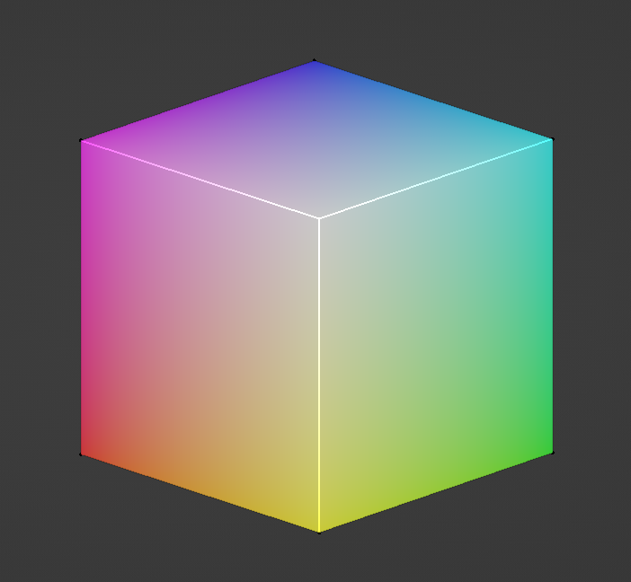
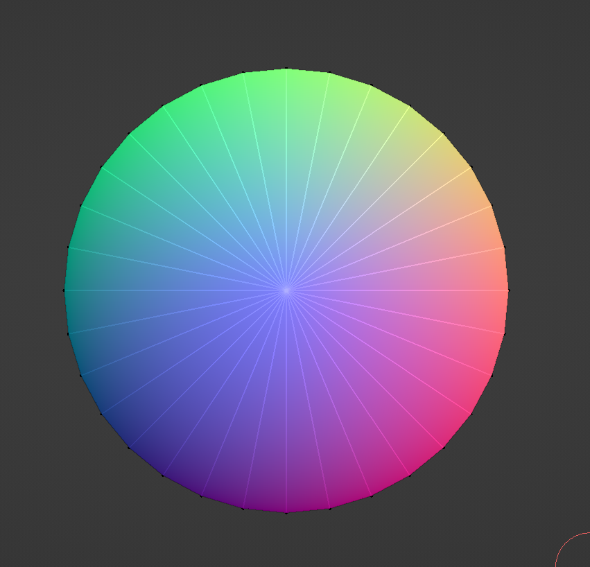

# Blender scripts

## utils.normal_to_rgb()

Returns a RGB value as a tuple. Takes a normal vector as an argument and processes it.

>Note: Blender seems to use the range 0.0 to 1.0 to express RGB values, whereas this function returns uint8 values.

## utils.get_vertex_normals()

Returns a dictionary where a vertex index is the key and a normalized direction vector is the value.
The vertex normal is calculated by using the normals of connected faces.

## Example: Use vertex normals to paint vertex colors

The normal can be passed to utils.normal_to_rgb(), which in turn can be used in conjunction with vertex painting:
```python
obj = bpy.context.object
vertex_data = get_vertex_normals(obj)
mesh = obj.data
mesh.use_paint_mask_vertex = True
bpy.ops.object.mode_set(mode="EDIT")
bpy.ops.mesh.select_mode(type="VERT")
bpy.ops.mesh.select_all(action="DESELECT")

for vert, normal in vertex_data.items():
    bpy.ops.object.mode_set(mode="OBJECT")
    mesh.vertices[vert].select = True
    color = normal_to_rgb(normal)  # Note that Blender actually wants the RGB values to be between 0.0 and 1.0, so this snippet doesn't quite work out of the box :(
    bpy.ops.object.mode_set(mode="VERTEX_PAINT")
    bpy.data.brushes["Draw"].color = color
    bpy.ops.paint.vertex_color_set()
    bpy.ops.object.mode_set(mode="OBJECT")
    mesh.vertices[vert].select = False
```

### Results

Cube


Cone
