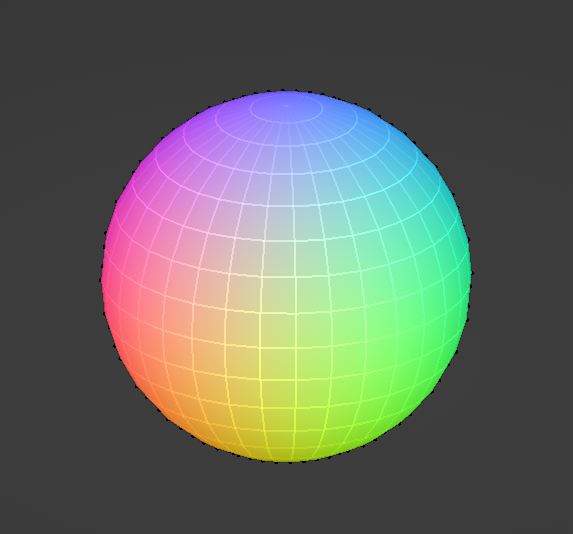

# Blender scripts

## utils.normal_to_rgb()

Returns a RGB value as a tuple. Takes a normal vector as an argument and processes it.

>Note: Blender seems to use the range 0.0 to 1.0 to express RGB values, whereas this function returns uint8 values.

## utils.get_vertex_normals()

Returns a dictionary where a vertex index is the key and a normalized direction vector is the value.
The vertex normal is calculated by using the normals of connected faces.

## Example: Use vertex normals to paint vertex colors

The normal can be passed to utils.normal_to_rgb(), which in turn can be used in conjunction with vertex painting.

Cube:

UV Sphere:

Cone, top view:

